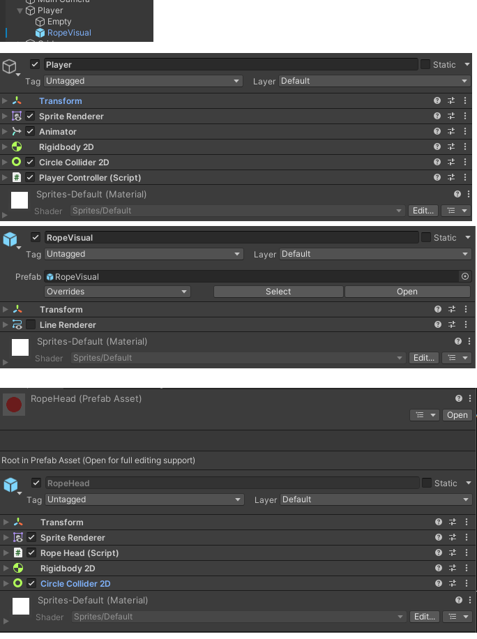

# ロープアクション
  
## Playerから射出される「ロープの先端」オブジェクトのプレハブを用意する
  
[サンプルの構成]
Player - PlayerController.cs  
　∟Empty（CreateEmpty）※地面判定用オブジェクト  
  ∟RopeVisual（CreateEmpty）※ロープの先端とPlayerをつなぐ縄部分　- LineRendererコンポーネント(普段は非表示)
  
(プレハブ）
RopeHead - RopeHead.cs
  

  

## PlayerController.csの役割

* 対応ボタンを押すとロープの先端（RopeHeadプレハブ）を生成して飛ばす　→ HandleRopeメソッド
生成時にRopeHead.cs側にPlayer情報を渡している (RopeHeadのInitメソッド)
* ロープの先端(RopeHead)とPlayer間の縄部分をRopeVisualオブジェクトに描画させている → UpdateRopeViusalメソッド
* ぶら下がり状態(isHanging)になった時には、ぶら下がり時の挙動を決めている → HandleSwingInputメソッド
※一定時間内に左右の振り子を繰り返さないとvelocityが増幅していかない工夫を多数の変数で行っている。
  
* ジャンプ(HandleJumpメソッド)では、通常時(isHangingではない）の挙動と分けて、ぶら下がり時（isHanging)はぶら下がり専用の計算方式になっている
* ロープが戻ってきた時や、ぶら下がりジャンプをした時、ロープ先端(RopeHead)との関係性<SpringJoint2Dコンポーネント>を切るのはPlayerControllerの役割 → ReleaseHangメソッド

## RopeHead.csの役割

* Playerがロープを投げた時に顕現するスクリプト、顕現と同時に時間をはかっている(変数timer)
* タイムアウトとする時間(変数returnDelay)が経つと、変数returningがtrueになりPlayerの方向に向けて戻る
* 一定距離まで戻ったらPlayerController.csに戻った事を通知（PlayerControlle.OnRopeReturnedメソッド）、ロープの先端は消滅
* 行きも戻りも、HockBlockタグのオブジェクトと接触したらぶら下がりを開始する
※具体的にはRopeHeadはHockBlockと同位置で固定(Rigidbody2Dをstatic)となり、Playerオブジェクトに＜SpringJoint2Dコンポーネント＞を付与
※SpringJoint2DコンポーネントをPlayerに付与した後は自分は用済みになるので自分自身をDestroyしている

  
