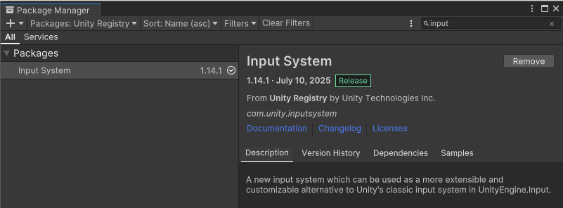
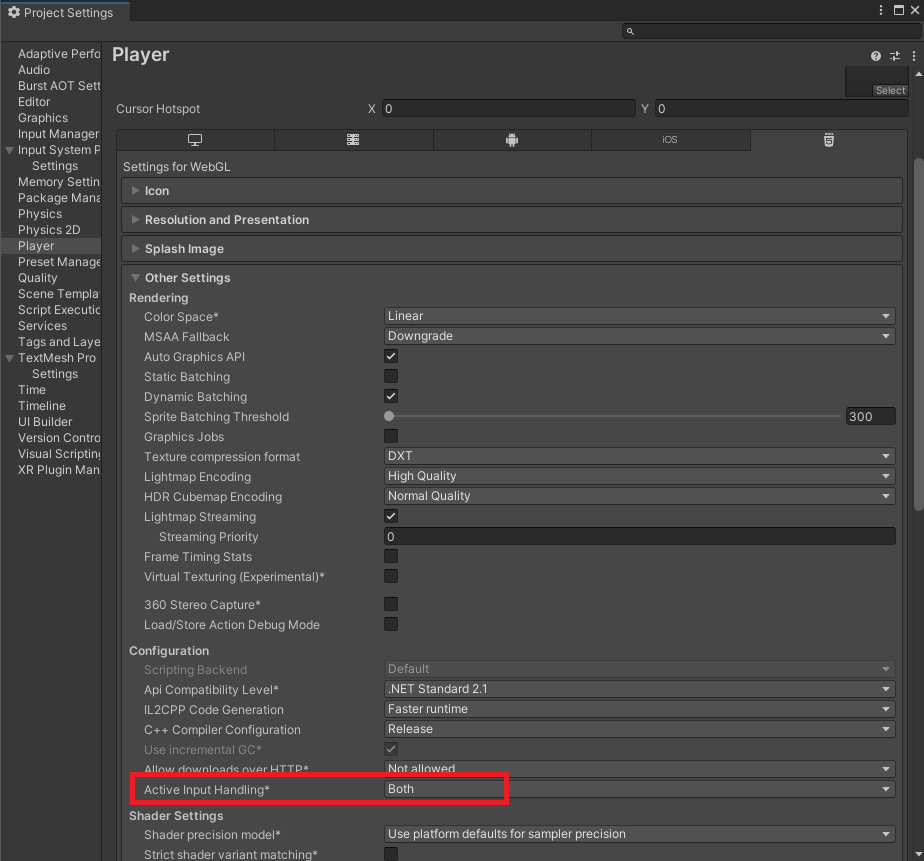
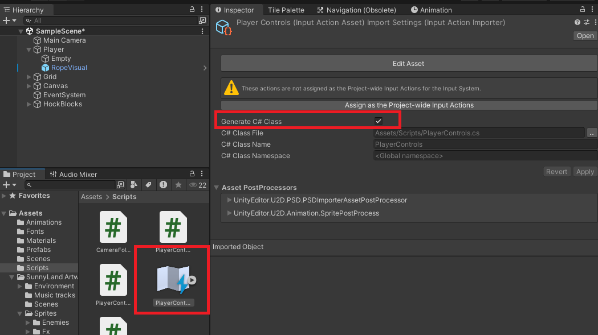
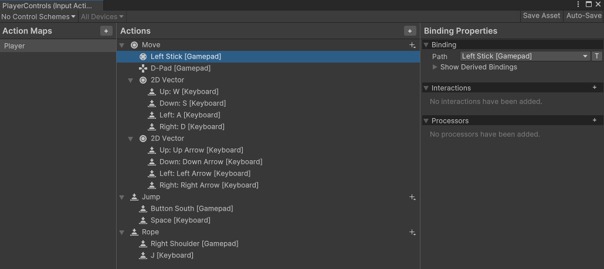

# ロープアクション
  
## Playerから射出される「ロープの先端」オブジェクトのプレハブを用意する
  
[サンプルの構成]
Player - PlayerController.cs  
　∟Empty（CreateEmpty）※地面判定用オブジェクト  
　∟RopeVisual（CreateEmpty）※ロープの先端とPlayerをつなぐ縄部分　- LineRendererコンポーネント(普段は非表示)
  
(プレハブ）
RopeHead - RopeHead.cs
  

  

## PlayerController.csの役割

* 対応ボタンを押すとロープの先端（RopeHeadプレハブ）を生成して飛ばす　→ HandleRopeメソッド  
生成時にRopeHead.cs側にPlayer情報を渡している (RopeHeadのInitメソッド)  
* ロープの先端(RopeHead)とPlayer間の縄部分をRopeVisualオブジェクトに描画させている → UpdateRopeViusalメソッド  
* ぶら下がり状態(isHanging)になった時には、ぶら下がり時の挙動を決めている → HandleSwingInputメソッド  
※一定時間内に左右の振り子を繰り返さないとvelocityが増幅していかない工夫を多数の変数で行っている。  
  
* ジャンプ(HandleJumpメソッド)では、通常時(isHangingではない）の挙動と分けて、ぶら下がり時（isHanging)はぶら下がり専用の計算方式になっている  
* ロープが戻ってきた時や、ぶら下がりジャンプをした時、ロープ先端(RopeHead)との関係性<SpringJoint2Dコンポーネント>を切るのはPlayerControllerの役割 → ReleaseHangメソッド  


## RopeHead.csの役割

* Playerがロープを投げた時に顕現するスクリプト、顕現と同時に時間をはかっている(変数timer)  
* タイムアウトとする時間(変数returnDelay)が経つと、変数returningがtrueになりPlayerの方向に向けて戻る  
* 一定距離まで戻ったらPlayerController.csに戻った事を通知（PlayerControlle.OnRopeReturnedメソッド）、ロープの先端は消滅  
* 行きも戻りも、HockBlockタグのオブジェクトと接触したらぶら下がりを開始する  
※具体的にはRopeHeadはHockBlockと同位置で固定(Rigidbody2Dをstatic)となり、Playerオブジェクトに＜SpringJoint2Dコンポーネント＞を付与  
※SpringJoint2DコンポーネントをPlayerに付与した後は自分は用済みになるので自分自身をDestroyしている  


# ゲームコントローラーとキーボードの共生

# ゲームコントローラーを受け入れするには「InputSystem」が必要 ※202507時点で最新のやり方
* まずはPackegeManagerから必要な機能InputSystemをインストール  
  
  
* Edit＞ProjectSettings＞Playerの スタンドアロンか WebGLの項目にて 「Other Settings」の「Active Input Handing」を"Both"にしてInputSystemも有効にする  
※Editorの再起動が入るので注意  
  
  
* 「Scripts」フォルダ内で右クリック＞Create>InputActionで「InputActionAssetファイル」を生成し、"PlayerControls"という名前にし、インスペクターで「GenerateC＃Class」にチェックを入れておく  
  
  
* PlayerControlsをダブルクリックして、次のようなアクション設定をする ※キーボードの設定もしておくこと  
  

* PlayerController.csにて、自分で設定したInputActionの項目名と対応する入力処置を記述していく
InputActionの設定を利用できるように下準備となる記述を加えておく  
```C#
//名前空間の呼び出し
using UnityEngine.InputSystem; //PackegeManagerからInputSystemパッケージの導入が必要

//変数宣言
[Header("コントローラー設定")]    
public PlayerControls controls; // InputaAtions設定より自動生成されたクラス(PlayerControls.cs)をプロジェクトからアタッチ
Vector2 moveInput;
bool jumpPressed;
bool ropeShootPressed;

void Awake()
{
    //新しいInputシステムのマッピングと連動

    controls = new PlayerControls(); //コントローラークラスの実体化

    // 移動入力
    //Moveアクションのいずれかがおされた時(performed)、アクションをやめた時(canceled)
    //ctxはCallbackContext 型の引数で無名関数、ReadValue<Vector2>()は入力を読み込む
    controls.Player.Move.performed += ctx => moveInput = ctx.ReadValue<Vector2>();
    controls.Player.Move.canceled += ctx => moveInput = Vector2.zero;

    // ジャンプアクションのいずれかがおされた時
    controls.Player.Jump.performed += ctx => jumpPressed = true;

    // ロープアクションのいずれかが押された時
    controls.Player.Rope.performed += ctx => ropeShootPressed = true;
}

 //次の2つはいずれもエントリーポイントの一種
 //オブジェクトが有効化された時
 //Input Systemは明示的に有効化（Enable()）しないと動作しない
 void OnEnable() => controls.Enable(); //メソッド定義：マッピングで決めた入力受付を有効
 //オブジェクトが無効化された時
 void OnDisable() => controls.Disable();//メソッド定義：マッピングで決めた入力受付も無効

// --- 入力検知用のメソッド群を作成しておく ---
float GetHorizontalInput() => moveInput.x; //移動入力値を取得
bool IsJumpPressed() => jumpPressed; //ジャンプボタン値を取得
bool IsRopeShootPressed() => ropeShootPressed; //ロープ射出ボタン値を取得
```

あとはそれぞれのポイントで作成したメソッドを活用して入力値を取得していく  
```C#
//移動メソッド
void HandleMovement()
{
    float h = GetHorizontalInput(); //移動入力値を取得

　　(省略)
}

//ジャンプメソッド
void HandleJump()
{
    if (IsJumpPressed()) //ジャンプボタンの受付があれば
    {

　　(省略)
}

//ロープ投げメソッド
void HandleRope()
{
    //ロープボタンが押されて、ロープ投げ中でなければ
    if (IsRopeShootPressed() && !ropeShot)
    {

　　(省略)
}
```
など
